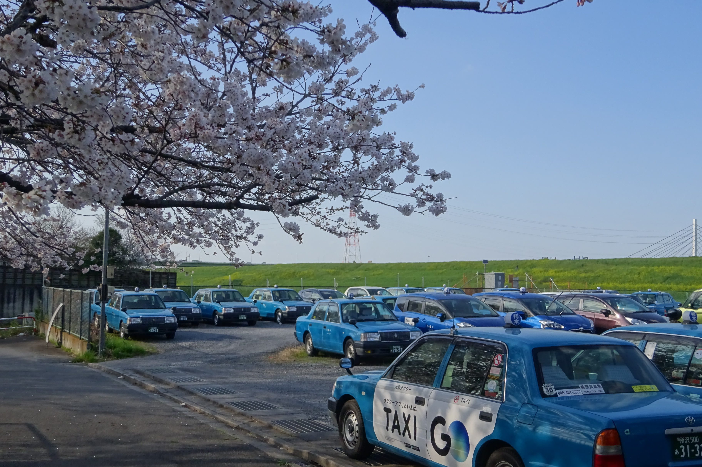

# 📸 Photo Sample Repository  
このレポジトリは、写真撮影および画像アップロードが問題なく行えることを示すための **サンプル写真集（Demo Repository）** です。  
内容は特定のテーマに依存せず、撮影・整理・公開の機能確認を目的としています。

---

# Sample Photos / サンプル写真集

以下は、撮影テストおよび GitHub アップロード動作確認のために掲載している写真です。  
現在は「桜」や「自然風景」など、日本国内で撮影した写真を例として使用しています。

---

## 📷 Sample 1

---

## 📷 Sample 2

---

## 📷 Sample 4

---

# 📝 Purpose / このレポジトリの目的

- GitHub への画像アップロードが正しく行えることの確認  
- Markdown による画像表示テスト  
- 研究・制作プロジェクトにおける **写真扱いの技術的証明（Evidence of Capability）**  
- 将来的なデータ整理・アルバム化・作品展示のベースとして  

---

# 📁 Repository Structure

